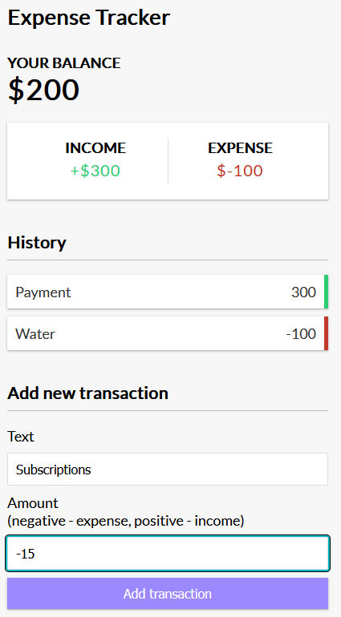

# 💰 Vue.js Expense Tracker

> A simple and elegant expense tracking application built with Vue.js 3, featuring real-time balance calculation and local storage persistence.

[](https://vuejs.org/)
[](https://vitejs.dev/)
[](https://developer.mozilla.org/en-US/docs/Web/JavaScript)

---

## 📸 Preview



The application provides a clean, intuitive interface for tracking your income and expenses with real-time balance updates and transaction history.

---

## ✨ Features

### 🎯 Core Features
- **💰 Real-time Balance Calculation** - Automatic balance updates as you add transactions
- **📊 Income & Expense Tracking** - Separate tracking for income (positive) and expenses (negative)
- **📝 Transaction History** - View all your transactions with visual indicators
- **💾 Local Storage** - Persistent data storage using browser's localStorage
- **🗑️ Transaction Management** - Easy deletion of transactions with confirmation
- **🔔 Toast Notifications** - User-friendly feedback for actions
- **📱 Responsive Design** - Works seamlessly on desktop and mobile devices

### 🎨 UI/UX Features
- **Clean Interface** - Minimalist design focused on usability
- **Color-coded Transactions** - Green for income, red for expenses
- **Hover Effects** - Interactive elements with smooth transitions
- **Form Validation** - Required field validation with error messages

---

## 🛠️ Tech Stack

| Technology | Purpose | Version |
|------------|---------|---------|
| **Vue.js 3** | Progressive JavaScript framework | ^3.4.29 |
| **Vite** | Fast build tool and dev server | ^5.3.1 |
| **Vue Toastification** | Toast notification system | ^2.0.0-rc.5 |
| **CSS3** | Styling and animations | - |
| **HTML5** | Markup structure | - |

---

## 🚀 Getting Started

### 📋 Prerequisites

- **Node.js**
- **npm** or **yarn** package manager

### 🔧 Installation

1. **Clone the repository**
   ```bash
   git clone https://github.com/kevinfjq/parking-control.git
   cd vue-expense-tracker
   ```

2. **Install dependencies**
   ```bash
   npm install
   # or
   yarn install
   ```

3. **Start the development server**
   ```bash
   npm run dev
   # or
   yarn dev
   ```

4. **Open your browser**
   - Navigate to `http://localhost:5173`
   - The application will automatically reload when you make changes

### 🏗️ Build for Production

```bash
npm run build
# or
yarn build
```

### 👀 Preview Production Build

```bash
npm run preview
# or
yarn preview
```

---

## 📁 Project Structure

```
vue-expense-tracker/
├── 📁 public/
│   └── 📄 favicon.ico
├── 📁 src/
│   ├── 📁 assets/
│   │   └── 📄 style.css           # Global styles
│   ├── 📁 components/
│   │   ├── 📄 AddTransaction.vue  # Add new transaction form
│   │   ├── 📄 Balance.vue         # Current balance display
│   │   ├── 📄 Header.vue          # Application header
│   │   ├── 📄 IncomeExpenses.vue  # Income/expense summary
│   │   └── 📄 TransactionList.vue # Transaction history list
│   ├── 📄 App.vue                 # Main application component
│   └── 📄 main.js                 # Application entry point
├── 📄 index.html                  # HTML template
├── 📄 package.json               # Project dependencies
└── 📄 README.md                  # Project documentation
```

---

## How to Use

### Adding Transactions

1. **📝 Enter Description** - Type a description for your transaction
2. **💵 Enter Amount** - Input the amount:
   - **Positive numbers** for income (e.g., `1000`)
   - **Negative numbers** for expenses (e.g., `-50`)
3. **✅ Submit** - Click "Add transaction" button

### Managing Transactions

- **🗑️ Delete** - Hover over a transaction and click the "x" button
- **👁️ View History** - All transactions are displayed in the history section
- **🔍 Visual Indicators** - Green border for income, red border for expenses

### Understanding Your Balance

- **💰 Current Balance** - Shows your total balance (income - expenses)
- **📈 Income** - Total of all positive transactions
- **📉 Expenses** - Total of all negative transactions

---

## 🔧 Configuration

### Toast Notifications

The application uses `vue-toastification` for user feedback. You can customize toast settings in `src/main.js`:

```javascript
app.use(Toast, {
  // Custom configuration options
  timeout: 3000,
  closeOnClick: true,
  pauseOnFocusLoss: true,
  pauseOnHover: true,
});
```

### Styling

Global styles are located in `src/assets/style.css`. The application uses CSS custom properties for easy theming:

```css
:root {
    --box-shadow: 0 1px 3px rgba(0, 0, 0, 0.12), 0 1px 2px rgba(0, 0, 0, 0.24);
}
```

---

## 📊 Data Storage

The application uses **localStorage** to persist your data:

- **Automatic Saving** - Transactions are saved automatically when added or deleted
- **Data Persistence** - Your data remains available between browser sessions
- **Cross-tab Sync** - Data is shared across multiple tabs of the same browser

### Storage Structure

```javascript
{
  "transactions": [
    {
      "id": 12345,
      "text": "Salary",
      "amount": 3000
    },
    {
      "id": 67890,
      "text": "Groceries",
      "amount": -150
    }
  ]
}
```
